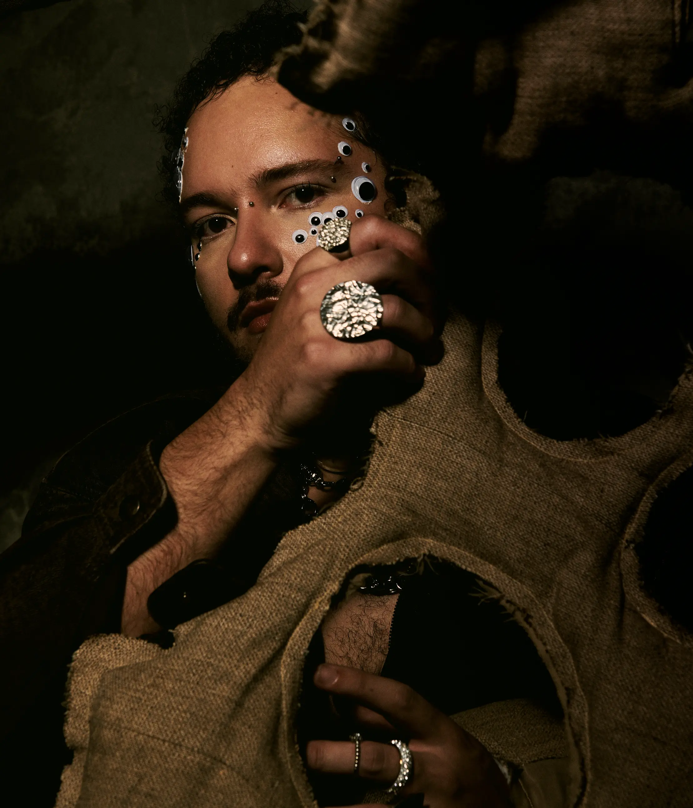

### **README.md (English)**

---

# Eutanásia - Postpunk Band from São Paulo

This is the official website of the musical project **Eutanásia**, a post-punk band from São Paulo created by **Pedro Werner**. The site provides information about the band, its musical releases, videos, and links to social media and streaming platforms.

## 🚀 **Project Overview**

The website was designed to be responsive, ensuring that the content is properly displayed on various devices, such as smartphones, tablets, laptops, and desktops. It uses **HTML5**, **CSS3**, and **Flexbox** to provide an optimized user experience.

## 📂 **File Structure**

- **index.html**: The main HTML file that structures the site’s content.
- **style.css**: The CSS file responsible for the site’s design and layout, including responsiveness and animations.
- **/photos/**: Directory containing images used on the site, such as band photos and background images.
- **/fonts/**: Directory containing custom fonts used on the site.

```

## 📱 **Responsiveness**

The website is fully responsive, adapting to different screen widths, such as:

- **Small Devices (smartphones)**: up to 414px.
- **Medium Devices (larger smartphones and tablets)**: between 415px and 768px.
- **Large Devices (tablets in landscape mode and small laptops)**: between 769px and 1024px.
- **Extra Large Devices (desktops and large laptops)**: above 1025px.

This is achieved using CSS media queries, allowing the layout and graphic elements to rearrange depending on the user’s device.

**Example CSS media query snippet:**
```css
@media (max-width: 414px) {
    .social i {
        flex-basis: 45%; /* Ensures 2 icons per row on smaller devices */
    }
}
```

## ⚙️ **Technologies Used**

- **HTML5**: For semantic content structuring.
- **CSS3**: For styling and responsive layout.
  - **Flexbox**: Used to create flexible and adaptable layouts.
  - **Media Queries**: To ensure responsiveness across different devices.
- **Font Awesome**: For icons used on the site.
- **Google Fonts**: For custom typography on the site.

**Example Flexbox snippet:**
```css
.social {
    display: flex;
    justify-content: space-around;
    flex-wrap: wrap;
}
```

## 🎨 **Design**

The site’s design uses a dark aesthetic, inspired by the band’s post-punk style, with:

- **Background images with translucent overlay** to maintain a mysterious atmosphere.
- **Animated social media icons** with scaling effects on hover.
- **Centered elements** distributed to provide easy navigation and a visually pleasing experience.

**Example of background and overlay:**
```css
.titulo {
    background-image: url('photos/bio.png');
    background-size: cover;
    background-attachment: fixed;
    background-blend-mode: overlay;
    color: #fff;
}
```

## 🌐 **Accessibility**

The site has been optimized for improved accessibility, ensuring that users with disabilities have a better experience. Key accessibility features include:

- **Aria-labels on links**: Added `aria-label` to links with non-discernible text to make the navigation clear for screen readers.
  
**Example aria-label snippet:**
```html
<a href="https://www.instagram.com/___eutanasia" target="_blank" aria-label="Instagram Profile">
    <i class="fa fa-instagram"></i>
</a>
```

- **Cross-Platform System Fonts**: Implemented system fonts that are legible across various devices and operating systems to enhance readability.

**Example cross-platform font snippet:**
```css
body {
    font-family: -apple-system, BlinkMacSystemFont, "Segoe UI", Roboto, "Helvetica Neue", Arial, sans-serif;
}
```

## 🔍 **Best Practices**

To ensure smooth performance and usability, several best practices were implemented:

- **WebP image format**: Large images have been converted to WebP format for better compression without quality loss, improving load times.

**Example WebP image snippet:**
```html

```

- **Embedded Lato Font-Family Fix**: Ensured that fonts load correctly across all browsers, maintaining consistent typography.

**Example font-face snippet:**
```css
@font-face {
    font-family: 'Lato';
    src: url('fonts/Lato-Regular.woff2') format('woff2');
}
```

- **Custom YouTube Player Script**: Improved performance of embedded YouTube players by using a custom script.


## 🌐 **SEO Enhancements**

To boost search engine visibility and improve page rankings, the following SEO improvements were made:

- **SEO Meta Tags**: Added optimized descriptions and keywords in the meta tags to improve search engine ranking.

**Example meta tag snippet:**
```html
<meta name="description" content="Eutanásia - Postpunk Band from São Paulo. Explore our music and videos.">
```

- **Removal of Unnecessary Files**: Unused PNG and JPG files were removed to optimize loading times and reduce site clutter.

- **Optimized Links**: Fixed broken external links (e.g., YouTube nocookie) to avoid 404 errors and ensure a smooth user experience.


---

## 📧 **Contact**

For more information about the band or the site, contact us through social media or via email: [pedrowrt@gmail.com](mailto:pedrowrt@gmail.com).

---


---

### **README.md (Português)**

---

# Eutanásia - Banda Postpunk de São Paulo

Este é o site oficial do projeto musical **Eutanásia**, uma banda post-punk de São Paulo criada por **Pedro Werner**. O site apresenta informações sobre a banda, seus lançamentos musicais, vídeos e links para redes sociais e plataformas de streaming.

## 🚀 **Visão Geral do Projeto**

O site foi desenvolvido para ser responsivo, garantindo que o conteúdo seja exibido corretamente em vários dispositivos, como smartphones, tablets, laptops e desktops. Ele utiliza **HTML5**, **CSS3** e **Flexbox** para fornecer uma experiência de usuário otimizada.

## 📂 **Estrutura de Arquivos**

- **index.html**: O arquivo HTML principal que estrutura o conteúdo do site.
- **style.css**: O arquivo CSS responsável pelo design e layout do site, incluindo responsividade e animações.
- **/photos/**: Diretório contendo imagens usadas no site, como fotos da banda e imagens de fundo.
- **/fonts/**: Diretório contendo as fontes personalizadas utilizadas no site.

## 📱 **Responsividade**

O site é totalmente responsivo, adaptando-se a diferentes larguras de tela, como:

- **Dispositivos Pequenos (smartphones)**: até 414px.
- **Dispositivos Médios (smartphones maiores e tablets)**: entre 415px e 768px.
- **Dispositivos Grandes (tablets em modo paisagem e laptops pequenos)**: entre 769px e 1024px.
- **Dispositivos Extra Grandes (desktops e laptops grandes)**: acima de 1025px.

Isso é feito usando media queries em CSS, permitindo que o layout e os elementos gráficos sejam reorganizados de acordo com o dispositivo do usuário.

**Exemplo de media query CSS:**
```css
@media (max-width: 414px) {
    .social i {
        flex-basis: 45%; /* Garante 2 ícones por linha em dispositivos menores */
    }
}
```

## ⚙️ **Tecnologias Utilizadas**

- **HTML5**: Para a estruturação semântica do conteúdo.
- **CSS3**: Para estilização e layout responsivo.
  - **Flexbox**: Utilizado para criar layouts flexíveis e adaptáveis.
  - **Media Queries**: Para garantir a responsividade em diferentes dispositivos.
- **Font Awesome**: Para os ícones utilizados no site.
- **Google Fonts**: Para a tipografia personalizada utilizada no site.

**Exemplo de código Flexbox:**
```css
.social {
    display: flex;
    justify-content: space-around;
    flex-wrap: wrap;
}
```

## 🎨 **Design**

O design do site usa uma estética escura, inspirada pelo estilo post-punk da banda, com:

- **Imagens de fundo com sobreposição translúcida** para manter uma atmosfera misteriosa.
- **Ícones de redes sociais animados** com efeitos de zoom ao passar o cursor.
- **Elementos centralizados** para proporcionar uma navegação fácil e uma experiência visual agradável.

**Exemplo de fundo e sobreposição:**
```css
.titulo {
    background-image: url('photos/bio.png');
    background-size: cover;
    background-attachment: fixed;
    background-blend-mode: overlay;
    color: #fff;
}
```

## 🌐 **Acessibilidade**

O site foi otimizado para melhorar a acessibilidade, garantindo que usuários com deficiência tenham uma melhor experiência. As principais funcionalidades de acessibilidade incluem:

- **Aria-labels nos links**: Adicionadas `aria-label` a links com texto não discernível para tornar a navegação clara para leitores de tela.
  
**Exemplo de aria-label:**
```html
<a href="https://www.instagram.com/___eutanasia" target="_blank" aria-label="Perfil do Instagram">
    <i class="fa fa-instagram"></i>
</a>
```

- **Fontes de Sistema Cross-Platform**: Implementadas fontes do sistema que são legíveis em vários dispositivos e sistemas operacionais para melhorar a legibilidade.

**Exemplo de fontes cross-platform:**
```css
body {
    font-family: -apple-system, BlinkMacSystemFont, "Segoe UI", Roboto, "Helvetica Neue", Arial, sans-serif;
}
```

## 🔍 **Melhores Práticas**

Para garantir um desempenho suave e usabilidade, várias melhores práticas foram implementadas:

- **Formato de imagem WebP**: Imagens grandes foram convertidas para o formato WebP para melhor compressão sem perda de qualidade, melhorando os tempos de carregamento.

**Exemplo de imagem WebP:**
```html

```

- **Correção da Fonte Lato Embutida**: Garantido que as fontes sejam carregadas corretamente em todos os navegadores, mantendo uma tipografia consistente.

**Exemplo de `font-face`:**
```css
@font-face {
    font-family: 'Lato';
    src: url('fonts/Lato-Regular.woff2') format('woff2');
}
```

- **Script Customizado para o Player do YouTube**: Melhorada a performance dos players do YouTube incorporados, utilizando um script customizado.

## 🌐 **Melhorias de SEO**

Para aumentar a visibilidade nos motores de busca e melhorar o ranqueamento da página, as seguintes melhorias de SEO foram feitas:

- **Meta Tags de SEO**: Adicionadas descrições e palavras-chave otimizadas nas meta tags para melhorar o ranqueamento.

**Exemplo de meta tag:**
```html
<meta name="description" content="Eutanásia - Banda Postpunk de São Paulo. Explore nossa música e vídeos.">
```

- **Remoção de Arquivos Desnecessários**: Arquivos PNG e JPG não utilizados foram removidos para otimizar o tempo de carregamento e reduzir o volume do site.

- **Links Otimizados**: Corrigidos links externos quebrados (por exemplo, YouTube nocookie) para evitar erros 404 e garantir uma experiência de usuário fluida.

---

## 📧 **Contato**

Para mais informações sobre a banda ou o site, entre em contato através das redes sociais ou por e-mail: [pedrowrt@gmail.com](mailto:pedrowrt@gmail.com).

---
